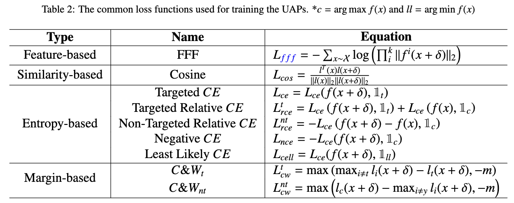

# Attack-Survey
- In this survey, we perform a series of experiments to evaluate different loss functions under the same training frameworks, including noise-based and generator-based. 
<div align="center">
  
</div>

- For the noise-based framework, we update the UAP with the calculated gradient proposed in representative and simple [F-UAP](https://openaccess.thecvf.com/content_CVPR_2020/html/Zhang_Understanding_Adversarial_Examples_From_the_Mutual_Influence_of_Images_and_CVPR_2020_paper.html).
- For the generator-based framework, we update the UAP generation network with conventional training techniques in [GAP](https://openaccess.thecvf.com/content_cvpr_2018/html/Poursaeed_Generative_Adversarial_Perturbations_CVPR_2018_paper.html).
## Run
- Run `bash generator-based/run.sh` to generate UAPs or test performance for generator-based methods. The bash script should be easy to adapt to perform different experiments of non-targeted attacks.
- Run `bash generator-based/run_target.sh` to generate UAPs or test performance for generator-based methods. The bash script should be easy to adapt to perform different experiments of targeted attacks.
- Run `bash noise-based/run.sh` to generate UAPs or test performance for noise-based methods. The bash script should be easy to adapt to perform different experiments of non-targeted attacks.
- Run `bash noise-based/run_target.sh` to generate UAPs or test performance for noise-based methods. The bash script should be easy to adapt to perform different experiments of targeted attacks.
## Defense Model
- Download the defense model from [Quark](https://pan.quark.cn/s/f9eeda3876a9) (Password:x9cT)
- Put models under ./pretrained_models
## Acknowledgments
Our code is based on [F-UAP](https://github.com/phibenz/uap_virtual_data.pytorch) and [GAP](https://github.com/OmidPoursaeed/Generative_Adversarial_Perturbations)
if you use our code, please also cite their paper.
```
@inproceedings{zhang2020understanding,
  title={Understanding Adversarial Examples From the Mutual Influence of Images and Perturbations},
  author={Zhang, Chaoning and Benz, Philipp and Imtiaz, Tooba and Kweon, In So},
  booktitle={Proceedings of the IEEE/CVF Conference on Computer Vision and Pattern Recognition},
  pages={14521--14530},
  year={2020}
}
@inproceedings{poursaeed2018generative,
  title={Generative adversarial perturbations},
  author={Poursaeed, Omid and Katsman, Isay and Gao, Bicheng and Belongie, Serge},
  booktitle={Proceedings of the IEEE Conference on Computer Vision and Pattern Recognition},
  pages={4422--4431},
  year={2018}
}
```
